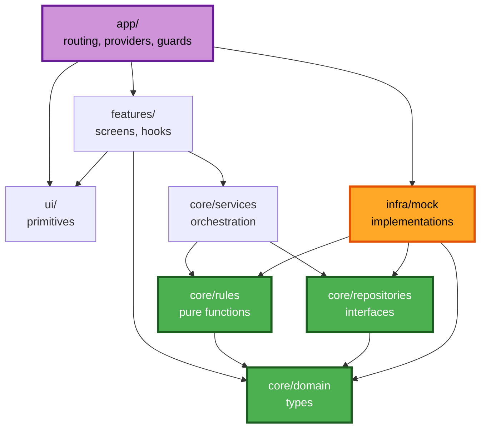
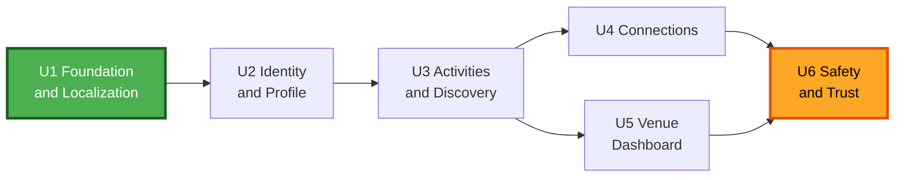

# Component Dependencies — Link

**Stage**: INCEPTION — Application Design
**Created**: 2026-07-30T03:30:00Z

Dependency matrix, communication patterns, and data flow.

---

## 1. Layer Dependency Rules

Four rules govern all imports. They are mechanically checkable and should be enforced by an ESLint import boundary rule at Code Generation.

| # | Rule | Why |
|---|---|---|
| **DEP-1** | `core/domain` imports nothing from the application | Root of the graph; keeps types portable to Round 2's backend |
| **DEP-2** | `features/`, `app/`, and `ui/` **must never import from `infra/`** | The rule that makes NFR-A1 real — components cannot know which repository implementation exists |
| **DEP-3** | `ui/` imports nothing from `core/`, `features/`, or `infra/` | Keeps primitives reusable and business-free |
| **DEP-4** | `core/services` imports repository **interfaces** only, never implementations | Same reason as DEP-2, one layer down |

**The one exception**: `app/RepositoryProvider` is the single module permitted to import `infra/`. It is the composition root. Swapping mock for HTTP is a change to this one file.

---

## 2. Layer Dependency Graph



**Text alternative** (arrows read "depends on"):

```
app/        --> features/, ui/, infra/   (infra ONLY here)
features/   --> ui/, core/services, core/domain
ui/         --> (nothing app-specific)
core/services --> core/rules, core/repositories
core/rules  --> core/domain
core/repositories --> core/domain
core/domain --> (nothing)
infra/mock  --> core/repositories, core/rules, core/domain
```

**Acyclicity**: verified. `core/domain` is a sink with no outgoing edges; `app/` is a source with no incoming edges. No cycles exist.

**Note the shape**: `infra/mock` depends on `core/rules` — the mock applies the same projection and filtering functions the UI would. This is deliberate. It means the safety invariants are implemented **once**, and in Round 2 the server imports the same functions. There is no second implementation to drift.

---

## 3. Module Dependency Matrix

`X` = depends on. Rows depend on columns.

| ↓ depends on → | domain | rules | repos | services | ui | infra |
|---|:--:|:--:|:--:|:--:|:--:|:--:|
| `core/domain` | — | | | | | |
| `core/rules` | X | — | | | | |
| `core/repositories` | X | | — | | | |
| `core/services` | X | X | X | — | | |
| `ui/` | | | | | — | |
| `features/identity` | X | | | X | X | |
| `features/activities` | X | X | | X | X | |
| `features/connections` | X | X | | X | X | |
| `features/venues` | X | | | X | X | |
| `features/safety` | X | | | X | X | |
| `features/notifications` | X | | | X | X | |
| `infra/mock` | X | X | X | | | — |
| `app/` | X | | X | X | X | **X** |

Features import `core/rules` only for **display-time derivations** — for example `deriveState` to label an activity as past, or `formatJalali` to render a date. They never call safety predicates to decide what to show, because by then the repository has already applied them.

---

## 4. Unit Dependency Graph



**Text alternative**:
```
U1 Foundation and Localization
  -> U2 Identity and Profile
       -> U3 Activities and Discovery
            -> U4 Connections  ----+
            -> U5 Venue Dashboard -+--> U6 Safety and Trust
```

| Unit | Depends on | Reason |
|---|---|---|
| U1 | — | Domain types, repository interfaces, mock store, RTL and Jalali infrastructure, UI primitives. Everything needs it. |
| U2 | U1 | Needs types, repositories, and primitives. Establishes the current-user context everything else reads. |
| U3 | U1, U2 | Activities have authors; the feed ranks by the viewer's neighborhood and interests. |
| U4 | U1, U2, U3 | Requests target activities; ratings depend on attendance at activities. |
| U5 | U1, U2, U3 | Venue activities are activities with constrained fields. |
| U6 | U1, U2, U3, U4 | Blocking must suppress visibility across **every** surface the earlier units built. It can only be verified once they exist. |

**U4 and U5 are independent of each other** and may be built in either order or in parallel.

**Why U6 is last**: this is the one ordering decision worth defending. Blocking could be built earlier, but its acceptance criterion is "absent from *every* feed, search result, and listing." That statement is only testable once every feed, search, and listing exists. Building it last means its property-based test runs against the complete set of read paths rather than a partial one.

---

## 5. Communication Patterns

| Pattern | Where used | Mechanism |
|---|---|---|
| **Dependency injection via context** | `app/RepositoryProvider` → all consumers | React context supplies concrete repositories. The NFR-A1 seam. |
| **Query / mutation** | Features → services → repositories | TanStack Query; hooks own cache keys, services own invalidation |
| **Pure function call** | Services and infra → `core/rules` | Synchronous, no I/O |
| **Viewer-scoped projection** | Repositories → features | Every read takes a viewer and returns a view type |
| **Event-derived notification** | `connectionService` → `notificationService` | Direct call within the operation; not an event bus — a bus would be over-engineering at this size |
| **Cache invalidation cascade** | Services → query client | Blocking is the widest cascade |

---

## 6. Data Flow — Safety-Critical Read Path

The path a feed request takes, showing where each invariant is enforced.

```
FeedScreen
  |
  | useFeed(mode, filters)
  v
activityService.getFeed({ viewerId, mode, filters, cursor })
  |
  | Pattern B - Scoped Read, no re-filtering
  v
ActivityRepository.listFeed({ viewerId, ... })          [interface]
  |
  v
MockActivityRepository.listFeed                          [infra]
  |
  +-- 1. load published, non-cancelled activities
  |
  +-- 2. rules.filterVisibleActivities(...)   --> INV-1  blocked authors removed
  |
  +-- 3. rules.applyFilters(...)                         category, date, type, query
  |
  +-- 4. rules.rankFeed(...)                             ordering only, set preserved
  |
  +-- 5. rules.projectActivities(...)          --> INV-2  exactAddress omitted
  |                                            --> INV-3  no contact details present
  |
  v
Page<ActivityView>   <-- exactAddress absent where precision is 'neighborhood'
  |
  v
ActivityCard renders ActivityView
```

**The property this buys**: `ActivityCard` cannot leak an address it was never given. The component has no code path to the exact address of an approximate-precision activity, because the field is absent from the object it receives. A future developer adding a share-preview feature to `ActivityCard` cannot accidentally expose it.

**Ordering matters**: blocking (step 2) runs before ranking (step 4) so a blocked author's activity never influences ordering. Projection (step 5) runs last so ranking can use the full record while the returned view cannot.

---

## 7. Data Flow — Contact Disclosure Write Path

```
JoinRequestSheet
  |
  +-- ContactShareSelector    nothing pre-selected
  +-- DisclosureNotice        mandatory, adjacent to send, not dismissible
  |
  | useSendJoinRequest()
  v
connectionService.sendJoinRequest(input)
  |
  +-- 1. activity is published and not past?           else refuse
  +-- 2. rules.canSendRequestTo(blocks)                else refuse   US-72
  +-- 3. duplicate request exists?                     else refuse   US-30
  +-- 4. rules.validateShareSelection(...)             else refuse   US-30
  |         resolves to EXACTLY the selected channel
  |         no fallback, no substitution
  v
ConnectionRepository.sendJoinRequest(...)
  |
  +-- persists request with only the resolved contact
  v
notificationService.create({ channel: 'in_app', ... })
  |
  v
Poster unread badge increments        the only signal - no push
```

**Asymmetry enforced structurally**: the requester's subsequent view is `SentRequestView`, a type that has no field for the poster's contact details. The one-way disclosure of FR-35 is guaranteed by the type, not by remembering not to render something.

---

## 8. Round-2 Swap Verification

The Round-1 quality gate is that swapping the repository implementation requires no screen changes. Concretely:

| Changes in Round 2 | Does not change |
|---|---|
| `app/RepositoryProvider` — supplies `infra/http` instead of `infra/mock` | Every file under `features/` |
| New `infra/http` implementing the same six interfaces | Every file under `ui/` |
| `authService` internals — real OTP | `core/domain`, `core/rules` |
| Server-side enforcement of INV-1 … INV-4 | `core/repositories` interfaces |
| | `core/services` signatures |

**How this gets verified rather than asserted**: Code Generation will produce a stub HTTP repository and a test that mounts the application against it. If any screen requires modification, NFR-A1 has been violated and the gate fails.

---

**End of component dependencies.**
