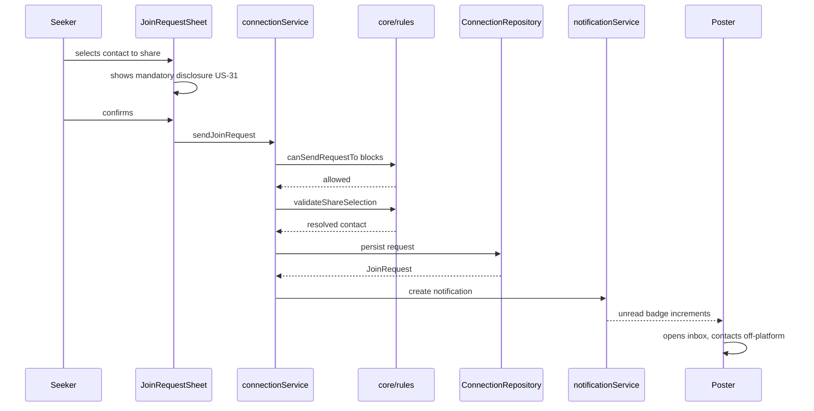

# Services — Link

**Stage**: INCEPTION — Application Design
**Created**: 2026-07-30T03:30:00Z

Service definitions, responsibilities, and orchestration patterns.

---

## 1. What a Service Is Here

In a frontend, "service layer" needs a concrete meaning. In Link it is:

> A **plain TypeScript module** that composes validation, business rules, and repository calls into a single named business operation.

**Services do**: sequence operations, apply rules before writes, coordinate multiple repositories, create side-effect records such as notifications, and invalidate caches.

**Services do not**: touch React, hold UI state, format text for display, or import concrete repository implementations.

**Why the layer exists**: without it, orchestration logic lands in hooks and is duplicated wherever an operation is triggered from more than one screen. `sendJoinRequest` is invoked from both the feed card and the activity detail screen — the validation and rule sequence must be identical from both.

**The Round-2 payoff**: each service method is a candidate API endpoint. `connectionService.sendJoinRequest` becomes `POST /activities/{id}/requests`. The service keeps the same signature; only its internals change from local orchestration to an HTTP call.

---

## 2. Service Catalogue

| Service               | Owns                                                   | Repositories used                                                                  | Unit |
| --------------------- | ------------------------------------------------------ | ---------------------------------------------------------------------------------- | ---- |
| `authService`         | Session lifecycle                                      | `UserRepository`                                                                   | U2   |
| `profileService`      | Profile creation, editing, deletion                    | `UserRepository`, `ReferenceDataRepository`                                        | U2   |
| `activityService`     | Activity authoring and lifecycle, feed retrieval       | `ActivityRepository`, `SafetyRepository`                                           | U3   |
| `connectionService`   | Join requests, contact disclosure, attendance, ratings | `ConnectionRepository`, `ActivityRepository`, `SafetyRepository`, `UserRepository` | U4   |
| `venueService`        | Venue registration, publishing, metrics                | `VenueRepository`, `ActivityRepository`                                            | U5   |
| `safetyService`       | Reporting, blocking                                    | `SafetyRepository`                                                                 | U6   |
| `notificationService` | In-app notification creation and reading               | `ConnectionRepository` (source events)                                             | U4   |

---

## 3. Orchestration Patterns

Four patterns cover every operation in the system. Naming them keeps implementations consistent.

### Pattern A — Validate → Rule → Persist

Used for writes with business preconditions.

```
1. Validate input shape and required fields
2. Load whatever state the rule needs
3. Call the pure rule function
4. If the rule refuses, return its reason without writing
5. Persist through the repository
6. Emit side effects (notification, cache invalidation)
```

### Pattern B — Scoped Read

Used for every read of user-visible content.

```
1. Resolve the viewer identity
2. Call the repository read with viewerId
3. Return the viewer-scoped view unchanged
```

The service **never re-filters** — the repository already upheld INV-1 … INV-4. Filtering twice would suggest the contract is not trusted, and would hide a broken implementation.

### Pattern C — Cascade Invalidate

Used when a write changes what is visible across many surfaces.

```
1. Perform the write
2. Invalidate every affected query key
```

Blocking is the case that matters: it changes feed, search, category listings, activity detail, and request eligibility simultaneously.

### Pattern D — Derive-Don't-Store

Used for state that is a function of time.

```
Compute from stored data + current time at read; never persist the derived value.
```

Applies to `past`, join eligibility, and attendance-confirmation prompts.

---

## 4. Service Definitions

### 4.1 `authService` (U2)

**Responsibility**: establish and clear the session. Round 1 is mocked; Round 2 calls the real OTP endpoints.

| Operation     | Pattern | Notes                                                                                             |
| ------------- | ------- | ------------------------------------------------------------------------------------------------- |
| `requestCode` | A       | Validates phone format before any call. Round 1: no SMS sent.                                     |
| `verifyCode`  | A       | Round 1 mock accepts any well-formed code. **Round 2 adds brute-force protection (SECURITY-12).** |
| `signOut`     | —       | Round 1 clears local session. **Round 2 must invalidate server-side (US-04).**                    |

**Round-2 boundary**: this service changes the most between rounds. Its interface must not leak that Round 1 is mocked — no `isMock` flags reaching callers.

---

### 4.2 `profileService` (U2)

| Operation       | Pattern | Notes                                                                                      |
| --------------- | ------- | ------------------------------------------------------------------------------------------ |
| `completeSetup` | A       | Requires at least one interest and a neighborhood before proceeding (US-02).               |
| `updateProfile` | A       | Changes propagate to already-published activities (US-03).                                 |
| `deleteAccount` | A + C   | **Anonymizes** authored activities rather than deleting them, then invalidates everything. |

---

### 4.3 `activityService` (U3)

| Operation        | Pattern | Notes                                                                                             |
| ---------------- | ------- | ------------------------------------------------------------------------------------------------- |
| `createActivity` | A       | **Requires an explicit location-precision choice — there is no default.** Rejects past dates.     |
| `editActivity`   | A       | Verifies ownership before writing. Client-side ownership checks are UX only (NFR-S6).             |
| `cancelActivity` | A + C   | Sets `cancelled`, notifies every requester (US-12), invalidates feed and detail.                  |
| `getFeed`        | B       | Passes viewer, mode, filters, cursor. Ranking happens in `core/rules`, invoked by the repository. |

**Safety note**: `createActivity` is where US-11 is enforced at write time — the precision field is required, not defaulted. `projectActivity` then enforces it on every read. Two independent layers, per SECURITY-11 defense in depth.

---

### 4.4 `connectionService` (U4) — highest safety sensitivity

This service owns the product's riskiest operation. Its sequence is specified here rather than left to implementation.

#### `sendJoinRequest`

```
1. Validate the activity exists, is published, and is not past
2. Check blocks in both directions -> refuse if blocked (US-72)
3. Check for an existing active request -> refuse duplicates (US-30)
4. Validate the share selection against the user's stored details
   -> resolve to exactly the selected channel, NEVER a substitute (US-30)
5. Persist the request carrying only the resolved contact
6. Create an in-app notification for the poster (US-40)
7. Invalidate the poster's inbox and unread count
```

**Rule**: step 4 must never fall back. If the user selected Telegram and has no Telegram ID stored, the operation fails and the UI prompts for one — it does not quietly send their phone number instead.

#### `withdrawRequest`

```
1. Verify the requester owns the request
2. Mark withdrawn and flag the shared contact revoked
3. Notify the poster
```

The UI must state honestly that the poster may already have seen and saved the detail (US-33). The service cannot undo disclosure and must not imply otherwise.

#### `confirmAttendance`

```
1. Verify the caller is the activity's poster
2. Verify the activity date has passed
3. Persist confirmations
4. Notify newly confirmed attendees that rating is open
5. Invalidate rateable-participant queries
```

#### `submitRating`

```
1. Load activity, attendance, and existing ratings
2. Call canRate -> refuse with its reason if not allowed (US-52)
3. Persist
4. Recompute the subject's rating summary
5. Notify the subject
```

**Rule**: step 2 is not optional and is not replaced by the UI hiding the control. In Round 2 the identical check runs server-side using the same pure function (NFR-S6).

---

### 4.5 `venueService` (U5)

| Operation              | Pattern | Notes                                                                                                                               |
| ---------------------- | ------- | ----------------------------------------------------------------------------------------------------------------------------------- |
| `registerVenue`        | A       | Creates the venue with `pending` status; publishing stays disabled.                                                                 |
| `publishVenueActivity` | A       | Refuses unless status is `approved` (US-61). Forces `locationPrecision: 'exact'` (FR-54). Writes the inert promotion field (FR-56). |
| `getDashboardSummary`  | B       | Activities with view and request counts; **no viewer personal data** (US-64).                                                       |

⚠️ **Known gap**: `registerVenue` produces `pending` venues, but no approver exists until Round 3. Round 1 seeds approved venues in mock data. **Round 2 must provide an approval path** or real registrations strand. Recorded in the execution plan's Deferrals Register.

---

### 4.6 `safetyService` (U6)

| Operation        | Pattern   | Notes                                                                                                                                                |
| ---------------- | --------- | ---------------------------------------------------------------------------------------------------------------------------------------------------- |
| `reportUser`     | A         | Stores full context — reporter, subject, reason, detail, evidence, related activity, timestamp — even though nothing reads it until Round 3 (US-70). |
| `reportActivity` | A         | Includes the suspected-harvesting reason (AB-01).                                                                                                    |
| `blockUser`      | A + **C** | The canonical cascade case: invalidates feed, search, categories, activity detail, request eligibility, and the blocked-users list.                  |
| `unblockUser`    | A + C     | Same invalidation set.                                                                                                                               |

**Design note**: blocking is enforced inside the repository (INV-1), so this service does not filter anything itself. Its job is to record the block and make sure nothing stale remains cached.

---

### 4.7 `notificationService` (U4)

| Operation        | Pattern | Notes                                                                                                                                |
| ---------------- | ------- | ------------------------------------------------------------------------------------------------------------------------------------ |
| `create`         | A       | Takes a channel parameter, always `'in_app'` in Round 1. The parameter exists so push can be added without a data migration (FR-72). |
| `getUnreadCount` | B       | Drives the badge — **the only retention mechanism in the product**, since there are no push notifications.                           |
| `markRead`       | A + C   | Invalidates the badge count.                                                                                                         |

**Notification triggers**: new join request, request withdrawn, activity cancelled, attendance confirmation due, rating received.

---

## 5. Service Interaction — Core Loop



**Text alternative**:

1. Seeker selects which contact detail to share in `JoinRequestSheet`
2. UI displays the mandatory disclosure (US-31) — unavoidable, adjacent to the send action
3. Seeker confirms
4. `connectionService.sendJoinRequest` is invoked
5. Service asks `core/rules` whether blocks permit the request — refuses if not
6. Service asks `core/rules` to validate and resolve the share selection — never substitutes a channel
7. Service persists the request through `ConnectionRepository`
8. Service asks `notificationService` to create the poster's notification
9. Poster's unread badge increments — the only signal, since there is no push
10. Poster opens the inbox and contacts the seeker **off-platform**. The app's involvement ends here.

---

## 6. Cross-Cutting Concerns

| Concern                | Where it lives                                                         | Note                                                            |
| ---------------------- | ---------------------------------------------------------------------- | --------------------------------------------------------------- |
| **Error handling**     | Services return typed failures; `GlobalErrorBoundary` catches the rest | Users see generic Persian messages, never internals (NFR-S7)    |
| **Cache invalidation** | Services own it; hooks do not invalidate directly                      | Keeps invalidation sets in one place per operation              |
| **Localization**       | `I18nProvider` and the string catalogue                                | Services never format user-facing text                          |
| **Logging**            | Round 2                                                                | Must never log contact details (NFR-S1)                         |
| **Authorization**      | `core/rules` predicates, called by services                            | Client-side checks are UX; server-side is the boundary (NFR-S6) |

---

**End of services.**
