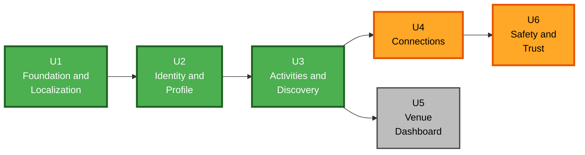

# Unit of Work Dependencies — Link

**Stage**: INCEPTION — Units Generation, Part 2 (Generation)
**Created**: 2026-07-30T03:50:00Z

Dependency matrix, critical path, and integration points.

---

## 1. Dependency Matrix

`X` = depends on. Rows depend on columns.

| ↓ depends on →                     | U1  | U2  | U3  | U4  | U5  | U6  |
| ---------------------------------- | :-: | :-: | :-: | :-: | :-: | :-: |
| **U1** Foundation and Localization |  —  |     |     |     |     |     |
| **U2** Identity and Profile        |  X  |  —  |     |     |     |     |
| **U3** Activities and Discovery    |  X  |  X  |  —  |     |     |     |
| **U4** Connections                 |  X  |  X  |  X  |  —  |     |     |
| **U5** Venue Dashboard             |  X  |  X  |  X  |     |  —  |     |
| **U6** Safety and Trust            |  X  |  X  |  X  |  X  |     |  —  |

**Acyclicity**: verified. U1 has no outgoing dependencies; U6 has no incoming ones. The matrix is strictly lower-triangular, which proves no cycles exist.

**Note**: U4 and U5 have no dependency in either direction.

---

## 2. Dependency Graph



**Text alternative** (arrows read "must be built before"):

```
U1 Foundation and Localization
   |
   v
U2 Identity and Profile
   |
   v
U3 Activities and Discovery
   |
   +-------------------+
   |                   |
   v                   v
U4 Connections     U5 Venue Dashboard
   |
   v
U6 Safety and Trust
```

Green = on the critical path. Orange = carries safety-critical stories. Grey = off the critical path.

---

## 3. Build Sequence and Critical Path

**Sequence**: `U1 → U2 → U3 → { U4, U5 } → U6`

**Critical path**: `U1 → U2 → U3 → U4 → U6` — five units.

**Off the critical path**: **U5 Venue Dashboard**. Nothing depends on it. U6's completeness check is stronger with U5 present (blocking must suppress venue activities too), but U6 does not require U5 to exist.

**Practical consequence**: if Round-1 scope needs cutting, **U5 is the only unit that can be dropped without breaking the product's core loop**. The consumer app would function fully; it would simply have less content, which matters for the cold-start problem noted in `personas.md`.

**Team note**: with a solo builder (Q7 `A`), the U4/U5 parallelism is not exploitable. It is recorded because it identifies the safe cut point above.

---

## 4. Why This Ordering

Each ordering constraint has a concrete reason, not just layering convention.

| Constraint               | Reason                                                                                                                                                                                                                                                                                                                                      |
| ------------------------ | ------------------------------------------------------------------------------------------------------------------------------------------------------------------------------------------------------------------------------------------------------------------------------------------------------------------------------------------- |
| **U1 before everything** | Domain types, repository interfaces, and UI primitives are imported by every other unit. Nothing compiles without them.                                                                                                                                                                                                                     |
| **U2 before U3**         | Activities have authors, and the feed ranks by the viewer's neighborhood and interests. Both require a user with a profile to exist.                                                                                                                                                                                                        |
| **U3 before U4**         | Join requests target activities. Attendance and ratings are scoped to an activity.                                                                                                                                                                                                                                                          |
| **U3 before U5**         | Venue activities are activities with constrained fields — they reuse the same entity, composer patterns, and feed rendering.                                                                                                                                                                                                                |
| **U4 before U6**         | Blocking must prevent join requests in both directions (US-72). That behaviour cannot be built or tested before requests exist.                                                                                                                                                                                                             |
| **U6 last**              | **The most deliberate choice here.** US-72 requires blocked users to be absent from _every_ feed, search result, and listing. That is only testable once every one of them exists. Building U6 last means its property-based test runs against the complete set of read paths rather than a partial one — verification instead of sampling. |

---

## 5. Integration Points Between Units

What each unit hands to the ones that follow.

| Provider            | Consumer | Interface handed over                                                                                                                                |
| ------------------- | -------- | ---------------------------------------------------------------------------------------------------------------------------------------------------- |
| U1 → all            | all      | Domain types, view types, 6 repository interfaces, `RepositoryProvider` context, 16 UI primitives, routing shell, RTL/Jalali/normalization utilities |
| U2 → U3, U4, U5, U6 |          | Session context with the current user; `NeighborhoodSelector` and `InterestSelector` reused by U3 filters                                            |
| U3 → U4             |          | `ActivityView` shape, `ActivityRepository`, activity lifecycle derivation, `ActivityCard`                                                            |
| U3 → U5             |          | Activity entity and composer patterns; U5 constrains rather than extends them                                                                        |
| U3 → U6             |          | The read paths — feed, search, category, detail — that blocking must suppress                                                                        |
| U4 → U6             |          | Join-request paths that blocking must refuse in both directions                                                                                      |
| U1 → U4             |          | Notification record shape with the `channel` field                                                                                                   |

---

## 6. Shared Resources and Contention

Places where more than one unit touches the same artifact. With a solo builder these are sequencing notes rather than conflict risks, but they identify where a change in a later unit can disturb an earlier one.

| Shared resource                 | Units                                       | Note                                                                                                                                                                                                |
| ------------------------------- | ------------------------------------------- | --------------------------------------------------------------------------------------------------------------------------------------------------------------------------------------------------- |
| `core/domain/types.ts`          | U1 owns; U3–U6 extend                       | Later units may add fields. Additions are safe; **changing an existing field's shape is a U1-level change** and must be re-checked against the repository contract.                                 |
| `core/rules/` directory         | U1 creates; U3, U4, U6 add modules          | Each rule module has exactly one owning unit. No module is co-owned.                                                                                                                                |
| `core/repositories/` interfaces | U1 defines all six                          | Later units implement usage, not definition. **A later unit needing an interface change is a signal that U1's contract was wrong** — worth pausing on, because that contract is also Round 2's API. |
| `infra/mock/`                   | U1 implements; later units extend seed data | Seed data grows per unit; the store schema version increments when entity shapes change.                                                                                                            |
| Persian string catalogue        | U1 scaffolds; every unit adds               | Single module per NFR-A5. Additive only.                                                                                                                                                            |
| `app/AppRouter`                 | U1 defines; each unit registers routes      | Additive. Role gating configured once in U1.                                                                                                                                                        |

---

## 7. Cross-Unit Verification Points

Checks that cannot be performed inside a single unit and must run at defined moments.

| Checkpoint                      | After     | Verifies                                                                                                                                                |
| ------------------------------- | --------- | ------------------------------------------------------------------------------------------------------------------------------------------------------- |
| **Repository swap test**        | U1        | A stub HTTP repository can be substituted for the mock with no `features/` changes. **This is NFR-A1's quality gate** — verified, not asserted.         |
| **RTL sweep**                   | each unit | Every new screen renders correctly right-to-left with Persian text. Per Q8 `A`, each unit must be demoable, which forces this check continuously.       |
| **Address-projection property** | U3        | Exact address never present in output for approximate-precision activities, across all viewers.                                                         |
| **Rating-eligibility property** | U4        | Only confirmed attendees and the poster can rate, after the date.                                                                                       |
| **Block-visibility property**   | U6        | No read path returns content from blocked users, in either direction. **The strongest check in the project**, and the reason U6 is last.                |
| **Full-loop integration**       | U6        | Discover → request → disclose → inbox → confirm → rate, end to end.                                                                                     |
| **Forward-compatibility audit** | U6        | `suspended`/`unpublished` states exist, report records store full context, notifications carry `channel`, activities carry the inert `promotion` field. |

---

## 8. Risk by Unit

| Unit   | Risk                           | Why                                                                                                                    | Mitigation                                                                                               |
| ------ | ------------------------------ | ---------------------------------------------------------------------------------------------------------------------- | -------------------------------------------------------------------------------------------------------- |
| **U1** | **High leverage**              | Errors propagate to every unit. The repository interface is also Round 2's API contract, so a wrong shape costs twice. | Repository swap test immediately after U1, before U2 begins                                              |
| **U2** | Low                            | Conventional flows; auth is mocked                                                                                     | —                                                                                                        |
| **U3** | **Medium-high**                | Carries US-11, and the ranking module is the most algorithmically involved code in Round 1                             | Property tests for both the address projection and ranking set-preservation                              |
| **U4** | **Highest safety sensitivity** | Carries US-31 and US-52. `sendJoinRequest` is where AR-02's accepted risk is either adequately mitigated or not        | Binding seven-step sequence in `services.md` §4.4; exhaustive property test over eligibility state space |
| **U5** | Low                            | Constrained reuse of U3                                                                                                | Note the venue-approval gap for Round 2                                                                  |
| **U6** | **Medium**, high consequence   | Small code volume, but US-72 must hold across every read path built in U1–U5                                           | Built last so the property test covers all paths; enforced at the repository layer per INV-1             |

---

**End of unit dependencies.**
