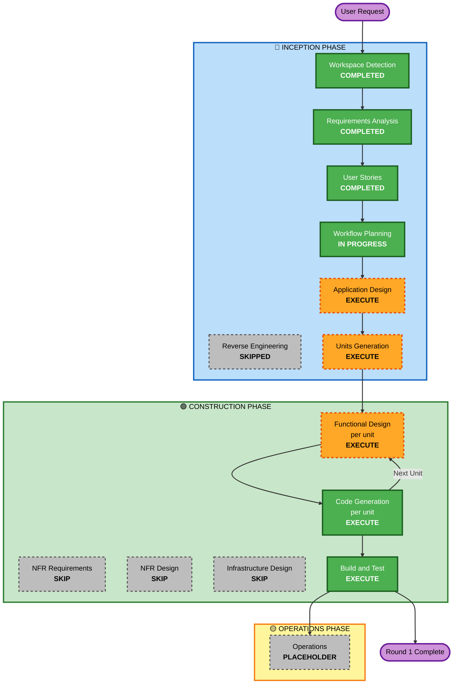

# Execution Plan — Link

**Stage**: INCEPTION — Workflow Planning
**Project**: Link
**Created**: 2026-07-30T03:10:00Z
**Status**: Awaiting approval

---

## 1. Detailed Analysis Summary

### 1.1 Transformation Scope
**N/A — greenfield project.** No existing codebase, no packages to transform, no deployment model to migrate. Workspace Detection confirmed an empty workspace and Reverse Engineering was correctly skipped.

### 1.2 Change Impact Assessment

| Impact area | Applies | Detail |
|---|---|---|
| **User-facing changes** | **Yes — total** | The entire Round-1 deliverable is user-facing: 35 Round-1 stories across a consumer web app and a venue dashboard, in Persian RTL. There is no internal-only component. |
| **Structural changes** | **Yes — foundational** | Establishes the whole architecture: repository abstraction layer (NFR-A1), shared domain types (NFR-A2), pure business-logic modules (NFR-A4), routing, and role gating. Every later round builds on choices made here. |
| **Data model changes** | **Yes — defines the model** | Seven core entities: User, Activity, JoinRequest, Attendance, Rating, Report, Venue, plus Neighborhood reference data. Two forward-compatibility obligations carried from stories: the inert promotion field (FR-56) and the `suspended`/`unpublished` states needed by Round 3. |
| **API changes** | **No in Round 1** | No backend exists. However, the repository interface defined in Round 1 **is the de facto API contract** — Round 2 implements against it. Getting it wrong is the main way Round 1 could damage Round 2. |
| **NFR impact** | **Yes — significant** | Localization (RTL, Jalali, Persian normalization) touches every screen. Performance targets assume constrained Iranian mobile networks. Security applies to contact-detail handling, content escaping, and headers. |

### 1.3 Component Relationships
**N/A — greenfield.** No existing components. The dependency structure between the *new* units is defined in §4.

### 1.4 Risk Assessment

Risk splits into two genuinely different profiles, so recording a single level would be misleading:

| Dimension | Level | Reasoning |
|---|---|---|
| **Engineering / delivery risk** | **Medium** | Greenfield, no production system, no users, no data to lose. Nothing to break. Complexity comes from breadth and from RTL/Jalali correctness, not from integration danger. |
| **Rollback complexity** | **Easy** | Nothing deployed in Round 1. Version-pinned rollback (NFR-R6) applies from Round 2. |
| **Testing complexity** | **Moderate to Complex** | Property-based testing is a blocking requirement (PBT extension), and seven invariants must hold universally rather than for sampled cases. RTL and bidirectional text add real test surface. |
| **Product / safety risk** | **High** | This is the honest number. The product arranges in-person meetings between strangers, discloses contact details with no approval gate (AR-02), and has no age restriction (AR-01). Four safety-critical stories (US-11, US-31, US-52, US-72) must be correct, not approximately correct. A defect here harms a person rather than degrading a feature. |

**Consequence for planning**: the plan below deliberately keeps Functional Design in scope for every unit that touches a safety invariant, even where the code volume is small.

---

## 2. Workflow Visualization



**Text alternative** (per content-validation.md):

```
INCEPTION PHASE
  Workspace Detection ........ COMPLETED
  Reverse Engineering ........ SKIPPED   (greenfield)
  Requirements Analysis ...... COMPLETED (approved)
  User Stories ............... COMPLETED (approved)
  Workflow Planning .......... IN PROGRESS
  Application Design ......... EXECUTE
  Units Generation ........... EXECUTE

CONSTRUCTION PHASE  (per-unit loop, repeated for each unit)
  Functional Design .......... EXECUTE   per unit
  NFR Requirements ........... SKIP      (covered at Requirements)
  NFR Design ................. SKIP      (follows from above)
  Infrastructure Design ...... SKIP      (no infrastructure in Round 1)
  Code Generation ............ EXECUTE   per unit
  -> loop back to Functional Design for the next unit
  Build and Test ............. EXECUTE   once, after all units

OPERATIONS PHASE
  Operations ................. PLACEHOLDER
```

---

## 3. Phases to Execute

### 🔵 INCEPTION PHASE

- [x] **Workspace Detection** — COMPLETED
- [x] **Reverse Engineering** — SKIPPED
  - **Rationale**: Greenfield. Workspace contained only `CLAUDE.md` and the rules directory; there was no code to analyze.
- [x] **Requirements Analysis** — COMPLETED and APPROVED
  - 53 functional and 40 non-functional requirements, comprehensive depth, 3 clarification rounds, 44 answers.
- [x] **User Stories** — COMPLETED and APPROVED
  - 40 stories, 4 personas, 5 abuse scenarios, full requirement coverage.
- [x] **Workflow Planning** — IN PROGRESS (this document)
- [ ] **Application Design** — **EXECUTE**
  - **Rationale**: Every component in the system is new. Three things specifically need designing before any code exists: (1) the **repository interface**, which is the contract Round 2's backend must satisfy — designing it casually is the single most expensive mistake available in Round 1; (2) the **pure business-logic modules** for ranking, rating eligibility, and visibility, which NFR-A4 requires be framework-independent and which the PBT extension will test as invariants; (3) the **component boundary between the user app and the venue dashboard**, since AS-05 puts them in one application behind role gating and feature bleed is the obvious failure mode.
- [ ] **Units Generation** — **EXECUTE**
  - **Rationale**: 35 Round-1 stories spanning identity, activities, discovery, contact exchange, ratings, venues, and safety is too much to design and generate as one undifferentiated block. The work also has genuine sequencing constraints — nothing can be built before the domain types and repository layer exist, and ratings depend on both activities and requests. Decomposing makes those dependencies explicit and lets each unit be completed and verified independently. A proposed decomposition is in §4; Units Generation will finalize it.

### 🟢 CONSTRUCTION PHASE (per-unit loop)

- [ ] **Functional Design** — **EXECUTE** (per unit)
  - **Rationale**: Two independent reasons. First, real business logic exists — feed ranking, rating eligibility as a predicate over request/attendance/date state, bidirectional block visibility, per-activity location precision. These are not CRUD. Second, **the PBT extension formally assigns rule PBT-01 to this stage**: identifying testable properties per component is mandatory and blocking, and the seven invariants already drafted in requirements §7.3 must be formalized here before code generation can consume them.
- [ ] **NFR Requirements** — **SKIP**
  - **Rationale**: The stage's own skip condition is "no NFR requirements / tech stack already determined" — both hold. Requirements §5 already specifies 40 NFRs across localization, usability, performance, architecture, security, resiliency, and testing. Requirements §6 already fixes the tech stack with rationale, including **PBT-09's framework selection (fast-check)**, which is the one obligation this extension assigns to this stage and which is therefore already satisfied. Re-running it per unit would restate approved decisions.
  - ⚠️ **Deferral recorded**: this stage **must execute in Round 2**, when a real backend introduces genuine per-unit NFR decisions.
- [ ] **NFR Design** — **SKIP**
  - **Rationale**: The stage rule states it executes only if NFR Requirements executed, and skips if it was skipped. Additionally, its NFR patterns (circuit breakers, health checks, retry policies, connection pooling) apply to server-side components that do not exist in Round 1.
  - ⚠️ **Deferral recorded**: **RESILIENCY-14** (the chaos/DR-testing approach question) is assigned by the extension to this stage. Skipping it here defers that question to **Round 2's NFR Design**, where it becomes meaningful. It is deferred, not waived. There is no deployed system in Round 1 whose failover could be tested.
- [ ] **Infrastructure Design** — **SKIP**
  - **Rationale**: Round 1 produces a static frontend bundle. There is no compute to size, no database to place, no network topology, no cloud resources. The hosting decision (Iranian provider, static hosting, security headers per NFR-S3) is a deployment configuration detail, not an infrastructure design exercise.
  - ⚠️ **Deferral recorded**: **must execute in Round 2**. Several SECURITY and RESILIENCY rules were marked "N/A → captured" at Requirements precisely because they land here: SECURITY-01, -02, -06, -07, -14 and RESILIENCY-05, -06, -07, -09, -12, -13.
- [ ] **Code Generation** — **EXECUTE** (per unit, ALWAYS)
  - **Rationale**: Mandatory stage. Produces the actual application: React components, domain types, repository interfaces plus mock implementation, business-logic modules, Persian string catalogue, seeded Tehran data, and both property-based and example-based tests.
- [ ] **Build and Test** — **EXECUTE** (ALWAYS, once after all units)
  - **Rationale**: Mandatory stage. Produces build instructions, unit and component test instructions, property-based test execution with seed logging (PBT-08), integration test instructions across units, and the CI configuration for GitHub Actions (NFR-R5).

### 🟡 OPERATIONS PHASE

- [ ] **Operations** — **PLACEHOLDER**
  - **Rationale**: Not implemented in this AI-DLC version. Round 1 has nothing to operate. Deployment and monitoring become real in Round 2.

---

## 4. Proposed Unit Decomposition (input to Units Generation)

Indicative only — Units Generation will confirm, split, or merge these.

| Unit | Name | Stories | Depends on | Why it is a unit |
|---|---|---|---|---|
| **U1** | Foundation and Localization | US-90, US-91, US-92 | — | Domain types, repository interface plus mock, seeded Tehran neighborhood data, RTL layout system, self-hosted Vazirmatn, Jalali date utilities, Persian text normalization, routing shell, design primitives. **Everything else depends on this.** Also where two PBT properties live (Jalali round-trip, normalization idempotence). |
| **U2** | Identity and Profile | US-01, US-02, US-03, US-04, US-73 | U1 | Authentication shell (mocked OTP), profile setup and editing, neighborhood and interest selection, account deletion, safety guidance screen. Establishes the current-user context every other unit reads. |
| **U3** | Activities and Discovery | US-10, US-11, US-12, US-13, US-20, US-21, US-22, US-23, US-24, US-25 | U1, U2 | Activity creation and lifecycle, **per-activity location precision (US-11, safety-critical)**, feed with three ranking modes, search, filters, categories, detail view. Contains the ranking module and two PBT invariants. |
| **U4** | Connections | US-30, US-31, US-32, US-33, US-40, US-41, US-50, US-51, US-52, US-53 | U1, U2, U3 | The full lifecycle from join request through contact disclosure, requests inbox, attendance confirmation, to ratings. Grouped as one unit because it is one continuous state machine — splitting it would scatter a single lifecycle. Contains **US-31 and US-52, both safety-critical**. |
| **U5** | Venue Dashboard | US-60, US-61, US-62, US-63, US-64 | U1, U2, U3 | Venue registration, approval-status states, role-gated dashboard, venue activity publishing with mandatory exact address, recurring activities, metrics. Separated because it is a distinct persona with a distinct surface. |
| **U6** | Safety and Trust | US-70, US-71, US-72 | U1, U2, U3, U4 | Reporting users and activities with full-context capture for Round 3, and **bidirectional blocking (US-72, safety-critical)**. Last because blocking must suppress visibility across every surface the earlier units created — it can only be verified once they exist. |

**Build sequence**: U1 → U2 → U3 → { U4, U5 } → U6. U4 and U5 both depend only on U1–U3 and could proceed in either order or in parallel.

**Round 2 and Round 3 units** (not in this plan's scope): backend API and real authentication, then the admin and moderation console.

---

## 5. Package Change Sequence
**N/A — greenfield.** No existing packages. Unit sequencing is in §4.

---

## 6. Estimated Timeline

**Stage count**, which is what this plan can honestly measure:

| Remaining stage | Count |
|---|---|
| Application Design | 1 |
| Units Generation | 1 |
| Functional Design (per unit, ~6 units) | ~6 |
| Code Generation (per unit, ~6 units) | ~6 |
| Build and Test | 1 |
| **Total remaining stages** | **~15** |

Each stage ends in an approval gate, so expect roughly 15 review points before Round 1 is complete.

**Relative unit sizing**: U1 and U4 are the largest (foundation breadth; lifecycle complexity). U2, U3, U5 are moderate. U6 is smallest in volume but touches every other unit's output.

**Calendar duration is deliberately not estimated.** It depends entirely on your availability and review turnaround, which I have no basis to guess at. Quoting "three weeks" would be a fabricated number, not a plan.

---

## 7. Success Criteria

### Primary Goal
A working, clickable Persian RTL responsive web application for Tehran, covering activity discovery, posting, consent-based contact exchange, attendance confirmation, ratings, a venue dashboard, and safety tooling — built on an architecture that accepts a real backend in Round 2 without rewriting screens.

### Key Deliverables
1. React + TypeScript web application, mobile-first, fully RTL, Persian only
2. Domain type definitions shared across the mock layer, UI, and future API client
3. Repository interface with a mock implementation persisting to localStorage
4. Pure business-logic modules: ranking, rating eligibility, visibility and blocking, location precision
5. Realistic seeded Persian data using real Tehran neighborhoods
6. Venue dashboard behind role gating
7. Property-based and example-based test suites
8. Build, test, and CI instructions for GitHub Actions

### Quality Gates
| Gate | Criterion |
|---|---|
| **Architecture** | Swapping the mock repository for a stub HTTP repository requires **no change to any screen component**. This is the test that proves NFR-A1 rather than asserting it. |
| **Safety invariants** | The four safety-critical stories hold universally under property-based testing: exact address never leaks for approximate-precision activities; the contact disclosure is present, unavoidable, and correctly worded; only confirmed attendees and the poster can rate; blocked users appear in no feed, search, or listing in either direction. |
| **Localization** | No untranslated English string is visible to users; layout is correct RTL throughout; all dates are Jalali; Jalali↔Gregorian round-trips exactly; Persian character variants and ZWNJ normalize correctly in search. |
| **Requirement coverage** | Every Round-1 requirement traces to generated code or an explicitly recorded deferral. |
| **Extension compliance** | Zero blocking SECURITY, RESILIENCY, or PBT findings at each stage gate. |
| **Forward compatibility** | The inert promotion field (FR-56) exists; `suspended` and `unpublished` states exist; report records store full context — so Rounds 2 and 3 need no data migration. |
| **Tests** | Property-based and example-based tests both present for business-critical paths (PBT-10), passing in CI with seeds logged (PBT-08). |

---

## 8. Deferrals Register

Recorded so nothing skipped here is silently lost.

| Deferred item | Deferred from | Due at | Why |
|---|---|---|---|
| NFR Requirements stage | Round 1 Construction | **Round 2** | NFRs and tech stack fully settled at Requirements; real per-unit NFR decisions arrive with the backend |
| NFR Design stage | Round 1 Construction | **Round 2** | Server-side NFR patterns need server-side components |
| **RESILIENCY-14** chaos/DR testing question | NFR Design | **Round 2 NFR Design** | Nothing deployed in Round 1 whose failover could be tested. **Deferred, not waived.** |
| Infrastructure Design stage | Round 1 Construction | **Round 2** | No compute, database, or network in a static frontend |
| SECURITY-01, -02, -06, -07, -14 | Requirements (marked N/A → captured) | **Round 2 Infrastructure Design** | Encryption at rest, intermediary logging, IAM, network config, alerting all require deployed infrastructure |
| RESILIENCY-05, -06, -07, -09, -12, -13 | Requirements (marked N/A → captured) | **Round 2 Infrastructure Design** | Monitoring, health checks, auto-scaling, backups, failover all require deployed services |
| **Venue approval has no approver** | User Stories (US-61) | **Round 2 planning** | FR-51 needs manual admin approval, but the admin console is Round 3. Round 1 seeds approval states in mock data; real signups would strand in Round 2. Needs a minimal approval tool or documented manual process. |
| Admin and moderation console | Requirements scope decision | **Round 3** | User decision CQ11 `B` |
| Recommendation engine | Requirements scope decision | **Later** | User decision Q8 `D`; the ranking module (FR-27) preserves the seam |
| Native mobile apps | Requirements scope decision | **Later** | User decision CQ3 `A`; React chosen to enable code reuse |
| Push notifications | Requirements scope decision | **Later** | User decisions Q18 `C`, CQ7 `A`; notification records shaped to accept a channel later |
| **AR-01 age policy review** | Requirements (accepted risk) | **Before public launch** | Recommended, not required. Also mandatory before any app store submission. |

---

**End of execution plan.**
