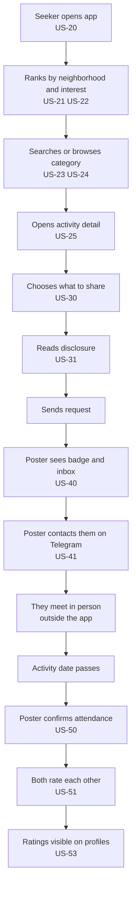

# User Stories — Link

**Stage**: INCEPTION — User Stories, Part 2 (Generation)
**Project**: Link
**Created**: 2026-07-30T03:00:00Z

**Format decisions** (approved in `story-generation-plan.md`):
Persona-based organization · Given/When/Then acceptance criteria · one story per user-visible capability · English with Persian UI copy quoted · all rounds tagged · abuse stories included · priority + requirement trace + round tag, no estimates.

---

## Contents

1. [Shared — Account and Profile](#1-shared--account-and-profile)
2. [P1 Activity Poster — Creating and Managing Activities](#2-p1-activity-poster--creating-and-managing-activities)
3. [P2 Activity Seeker — Discovery](#3-p2-activity-seeker--discovery)
4. [Contact Exchange — Requester Side](#4-contact-exchange--requester-side)
5. [Contact Exchange — Poster Side](#5-contact-exchange--poster-side)
6. [Attendance and Ratings](#6-attendance-and-ratings)
7. [P3 Venue Owner](#7-p3-venue-owner)
8. [Safety](#8-safety)
9. [P4 Moderator — Round 3](#9-p4-moderator--round-3)
10. [Cross-Cutting — Localization](#10-cross-cutting--localization)
11. [End-to-End Journey](#11-end-to-end-journey)
12. [Safety and Abuse Scenarios](#12-safety-and-abuse-scenarios)
13. [Requirement Coverage](#13-requirement-coverage)
14. [INVEST and Quality Verification](#14-invest-and-quality-verification)

**Legend** — Priority: Must / Should / Could · Round: 1 (web frontend + mocks), 2 (backend), 3 (admin console)

---

# 1. Shared — Account and Profile

## US-01 — Sign in with phone and OTP
**As** any user, **I want** to sign in with my phone number and a one-time code, **so that** I can access the app without managing a password.

**Priority**: Must · **Traces**: FR-01, FR-02, NFR-S1 · **Round**: 1 (mocked) / 2 (real SMS)

**Acceptance Criteria**
- **Given** I am signed out, **When** I enter a valid Iranian mobile number, **Then** I am shown a code-entry screen and a code is sent (Round 1: any 5-digit code is accepted by the mock; Round 2: sent via Kavenegar).
- **Given** I am on the code-entry screen, **When** I enter an incorrect code, **Then** I see a generic Persian error and remain on the screen, with no indication of whether the number is registered.
- **Given** I enter a malformed phone number, **When** I submit, **Then** validation rejects it before any request is made.
- **Given** I sign in successfully for the first time, **When** authentication completes, **Then** I am routed to profile setup (US-02) rather than the feed.
- **Given** I am signed in, **When** any screen renders, **Then** my phone number is never displayed anywhere in the UI.
- **Given** any log or analytics event is emitted, **When** it is written, **Then** it contains no phone number, no OTP, and no contact detail (NFR-S1).
- **Round 2 only — Given** repeated failed code attempts on one number, **When** a threshold is exceeded, **Then** further attempts are throttled (SECURITY-12).

**Notes**: No age gate is presented at signup — this is AR-01, an explicitly accepted risk. See US-73.

---

## US-02 — Set up my profile
**As** a new user, **I want** to set my name, interests, and home neighborhood, **so that** the feed is relevant to me and others can judge who I am.

**Priority**: Must · **Traces**: FR-03, FR-21, FR-22 · **Round**: 1

**Acceptance Criteria**
- **Given** I have just signed in for the first time, **When** profile setup opens, **Then** I can set display name, optional avatar, optional short bio, one or more interest tags, and a home neighborhood.
- **Given** I am choosing a home neighborhood, **When** the selector opens, **Then** I pick from a list of real Tehran neighborhoods grouped by district — **and the app never requests device location permission** (CQ8 `B`).
- **Given** I have not entered a display name, **When** I try to continue, **Then** I am blocked with a clear Persian explanation. *(**AMENDED 2026-08-05, CR-02 items 2 and 4**: interests and location were both required and are now optional; a city replaced the neighborhood. The name is the only requirement left.)*
- **Given** I have entered a name and skipped everything else, **When** I continue, **Then** setup completes.
- **Given** I complete setup, **When** I continue, **Then** I land on a feed already ranked by my neighborhood and interests.

---

## US-03 — Manage my profile and account
**As** a user, **I want** to edit my profile or delete my account, **so that** I stay in control of what the app shows about me.

**Priority**: Must · **Traces**: FR-03, FR-06 · **Round**: 1

**Acceptance Criteria**
- **Given** I am on my profile, **When** I edit any field and save, **Then** the change is reflected everywhere my profile appears, including on activities I have already posted.
- **Given** I request account deletion, **When** I confirm through an explicit confirmation step, **Then** my personal data is removed, my past activities are anonymized rather than deleted, and I am signed out.
- **Given** my account is deleted, **When** another user views an activity I posted, **Then** the activity remains visible with an anonymized author and no contact route to me.

---

## US-04 — Sign out and session expiry
**As** a user, **I want** my session to end when I sign out or after a period of inactivity, **so that** someone else using my phone cannot access my account.

**Priority**: Must · **Traces**: FR-07, NFR-S6 · **Round**: 2

**Acceptance Criteria**
- **Given** I am signed in, **When** I sign out, **Then** my session is invalidated server-side, not merely cleared client-side.
- **Given** my session has expired, **When** I open the app, **Then** I am returned to sign-in with no protected data having rendered first.
- **Given** a session cookie is issued, **When** inspected, **Then** it carries `Secure`, `HttpOnly`, and `SameSite` attributes (SECURITY-12).

---

# 2. P1 Activity Poster — Creating and Managing Activities

## US-10 — Create an activity
**As** an Activity Poster, **I want** to publish an activity with a clear description, time, and place, **so that** interested people nearby can find it and reach out.

**Priority**: Must · **Traces**: FR-10, FR-12, FR-14 · **Round**: 1

**Acceptance Criteria**
- **Given** I am signed in, **When** I open activity creation, **Then** I can enter title, description, one or more category tags, a date and time, a neighborhood, a location-precision choice (US-11), an optional capacity, and an optional image.
- **Given** I set a date, **When** the date picker opens, **Then** it is a **Jalali** picker (US-91).
- **Given** I select a date in the past, **When** I try to publish, **Then** I am blocked with a clear Persian message.
- **Given** I leave a required field empty, **When** I try to publish, **Then** validation identifies each missing field in Persian, inline.
- **Given** I publish successfully, **When** publication completes, **Then** the activity appears in the feed for users whose neighborhood or interests match, and in my own activity list with state `published`.
- **Given** I set a capacity, **When** requests arrive, **Then** capacity is displayed as information only — **the app never blocks a request for exceeding it** (FR-14).

**Notes**: Capacity being advisory is a direct consequence of there being no roster (CQ5). The UI must not imply seats are reserved.

---

## US-11 — Choose how precisely my location is shown
**As** an Activity Poster, **I want** to decide per activity whether the exact address is public, **so that** I can host at a café openly or at home privately.

**Priority**: Must · **Traces**: FR-11, §1.3 · **Round**: 1 · **Safety-critical**

**Acceptance Criteria**
- **Given** I am creating an activity, **When** I reach the location step, **Then** I must choose either **exact address** (`آدرس دقیق`) or **neighborhood only** (`فقط محله`) — there is no default that silently exposes an address.
- **Given** I choose **neighborhood only**, **When** any other user views the activity — including someone who has sent a join request — **Then** the exact address is **absent from the rendered output and from the underlying data delivered to the client**, not merely hidden with CSS.
- **Given** I choose **neighborhood only**, **When** I view my own activity, **Then** I still see the full address I entered.
- **Given** I choose **exact address**, **When** any user views the activity, **Then** the full address is shown.
- **Given** an activity of either precision, **When** it is rendered anywhere — feed card, detail view, search result, share preview — **Then** the same precision rule applies consistently in every surface.

**Notes**: This is one of the two most important invariants in the product. It maps directly to the PBT property *"exact address is never present in output for approximate-precision activities, for any viewer"* (requirements §7.3). Client-side hiding is explicitly **not** sufficient (NFR-S6).

---

## US-12 — Edit or cancel my activity
**As** an Activity Poster, **I want** to change or cancel my activity, **so that** people are not misled when plans change.

**Priority**: Must · **Traces**: FR-13, FR-12 · **Round**: 1

**Acceptance Criteria**
- **Given** I own a published activity, **When** I edit and save it, **Then** the changes are visible to everyone immediately.
- **Given** I cancel an activity, **When** cancellation completes, **Then** its state becomes `cancelled`, it is removed from the feed, and everyone who sent a join request sees the cancellation in their sent-requests list (US-33) and in their in-app notifications (FR-70).
- **Given** an activity is cancelled, **When** anyone opens it directly, **Then** it clearly shows as cancelled rather than appearing normal.
- **Given** I do not own an activity, **When** I view it, **Then** no edit or cancel control is present — **and** the underlying action rejects the attempt regardless of what the client shows (NFR-S6).

---

## US-13 — See my activities and their state
**As** an Activity Poster, **I want** one place showing everything I have posted and what stage it is at, **so that** I know what needs my attention.

**Priority**: Must · **Traces**: FR-12, FR-40 · **Round**: 1

**Acceptance Criteria**
- **Given** I open my activities, **When** the list renders, **Then** activities are grouped as upcoming, past, and cancelled, each showing its request count.
- **Given** an activity's date has passed and I have not yet confirmed attendance, **When** I view the list, **Then** that activity is visibly flagged as needing attendance confirmation (US-50).
- **Given** I have posted nothing, **When** the list renders, **Then** an empty state explains how to create a first activity (NFR-U5).

---

# 3. P2 Activity Seeker — Discovery

## US-20 — Browse the combined feed
**As** an Activity Seeker, **I want** a default feed blending nearby and relevant activities, **so that** I see things worth my time without configuring anything.

**Priority**: Must · **Traces**: FR-20, FR-23, FR-27, NFR-P4 · **Round**: 1

**Acceptance Criteria**
- **Given** I open the app signed in, **When** the feed loads, **Then** it shows published, non-past, non-cancelled activities ranked by combined neighborhood proximity and interest match.
- **Given** the feed is ranked, **When** ranking is applied, **Then** the output contains exactly the same activities as the input set — none added, none dropped (invariant; requirements §7.3).
- **Given** I have blocked a user, **When** the feed renders, **Then** none of their activities appear, under any ranking or filter (US-72).
- **Given** more results exist than one page, **When** I scroll, **Then** the next page loads via cursor pagination — never a full-list fetch (NFR-P4).
- **Given** no activities match, **When** the feed renders, **Then** an empty state suggests widening the neighborhood or exploring categories, rather than showing a blank screen (NFR-U5).

**Notes**: Ranking must live in an isolated, independently testable module (FR-27) — it is the seam where the recommendation engine lands later.

---

## US-21 — See activities near my neighborhood
**As** an Activity Seeker, **I want** to see what is happening close to me, **so that** I can join something without crossing Tehran.

**Priority**: Must · **Traces**: FR-21, CQ8 `B` · **Round**: 1

**Acceptance Criteria**
- **Given** I have a home neighborhood set, **When** I sort by proximity, **Then** activities are ordered by neighborhood closeness to mine.
- **Given** proximity is computed, **When** it is computed, **Then** it uses **only** my manually selected neighborhood — **the app must never request, receive, or store device GPS coordinates** (§1.3).
- **Given** I want to look elsewhere, **When** I change the neighborhood filter, **Then** results update without altering my saved home neighborhood.

---

## US-22 — See activities matching my interests
**As** an Activity Seeker, **I want** activities matching my stated interests surfaced, **so that** I find the niche things I actually care about.

**Priority**: Must · **Traces**: FR-22 · **Round**: 1

**Acceptance Criteria**
- **Given** I have interest tags set, **When** I sort by interest, **Then** activities sharing more of my tags rank higher.
- **Given** I have no interests set, **When** I sort by interest, **Then** I am prompted to add interests rather than shown an empty list.

---

## US-23 — Search and filter activities
**As** an Activity Seeker, **I want** to search and narrow results, **so that** I can find one specific thing rather than browse.

**Priority**: Must · **Traces**: FR-24, NFR-L6, NFR-P2 · **Round**: 1

**Acceptance Criteria**
- **Given** I type Persian text into search, **When** results return, **Then** activities whose title or description match are shown, with Persian character variants (ک/ك, ی/ي) and ZWNJ normalized so spelling variations still match (US-92).
- **Given** I apply filters, **When** I combine category, neighborhood, date range, and type (user vs venue), **Then** results satisfy all active filters.
- **Given** I apply the same filters in a different order, **When** results return, **Then** the result set is identical (commutativity; requirements §7.3).
- **Given** I change any filter, **When** results update, **Then** the update completes in under 200 ms against the mock layer (NFR-P2).
- **Given** filters produce no results, **When** the list renders, **Then** an empty state names which filters are active and offers to clear them.

---

## US-24 — Browse by category
**As** an Activity Seeker, **I want** to browse categories, **so that** I can explore without knowing what to search for.

**Priority**: Must · **Traces**: FR-25 · **Round**: 1

**Acceptance Criteria**
- **Given** I open categories, **When** the list renders, **Then** all activity categories are shown in Persian with a count of upcoming activities in each.
- **Given** I select a category, **When** results load, **Then** only upcoming activities in that category are shown, still respecting my blocks.

---

## US-25 — View activity detail
**As** an Activity Seeker, **I want** full detail about an activity and its host, **so that** I can decide whether to reach out to a stranger.

**Priority**: Must · **Traces**: FR-26, FR-11, FR-43 · **Round**: 1

**Acceptance Criteria**
- **Given** I open an activity, **When** it renders, **Then** I see the full description, category tags, Jalali date and time, location at the poster's chosen precision (US-11), the poster's display name, avatar, aggregate rating and activities-attended count, and the join action.
- **Given** the poster has no ratings yet, **When** the detail renders, **Then** it shows "no ratings yet" rather than an implied zero score.
- **Given** the activity is a venue activity, **When** it renders, **Then** it shows the verified venue badge and an exact address (US-62).
- **Given** the activity is past or cancelled, **When** it renders, **Then** the join action is absent.
- **Given** any user-generated text renders, **When** it is displayed, **Then** it is escaped — no HTML or script from user content is ever interpreted (NFR-S2).

---

# 4. Contact Exchange — Requester Side

> This section and the next describe a **deliberately asymmetric** flow. The requester discloses; the poster receives; nothing flows back (FR-35). Implementing this symmetrically would be a defect.

## US-30 — Send a join request and choose what to share
**As** an Activity Seeker, **I want** to express interest and choose exactly what contact detail to give, **so that** the host can reach me on my terms.

**Priority**: Must · **Traces**: FR-30, FR-31, AR-02 · **Round**: 1 · **Safety-critical**

**Acceptance Criteria**
- **Given** I open the join action on an upcoming activity, **When** the sheet opens, **Then** I can write an optional short note and must actively choose what to share: **phone number** (`شماره تلفن`), **Telegram ID** (`آی‌دی تلگرام`), or **nothing** (`هیچ‌کدام`).
- **Given** the share options render, **When** they first appear, **Then** **nothing is pre-selected** — no contact detail is shared by default under any circumstance.
- **Given** I select Telegram ID, **When** I have not stored one, **Then** I am asked to enter it at that moment rather than being silently switched to my phone number.
- **Given** I submit the request, **When** it is sent, **Then** only the detail I explicitly selected is transmitted — never both, never a fallback.
- **Given** I have already requested this activity, **When** I view it, **Then** the join action shows my existing request state instead of allowing a duplicate.
- **Given** I have blocked the poster or been blocked by them, **When** I view the activity, **Then** the join action is unavailable (US-72).

---

## US-31 — Understand what I am about to disclose
**As** an Activity Seeker, **I want** to be told plainly what happens to my contact detail before I send it, **so that** I am not surprised by a stranger contacting me.

**Priority**: Must · **Traces**: FR-32, AR-02, SECURITY-11 · **Round**: 1 · **Safety-critical**

**Acceptance Criteria**
- **Given** I have selected a contact detail to share, **When** the confirmation renders, **Then** an unavoidable disclosure is displayed stating that the detail is sent **immediately**, that the host is a **stranger who has not approved** the request, and that it **cannot be taken back**.
- **Given** the disclosure renders, **When** displayed in Persian, **Then** it reads: `این اطلاعات بلافاصله برای میزبان ارسال می‌شود. میزبان فردی ناشناس است و درخواست شما را تأیید نکرده است. پس از ارسال، امکان پس‌گرفتن آن وجود ندارد.`
- **Given** the disclosure is present, **When** the screen renders, **Then** it is visible without scrolling, adjacent to the send action, and not collapsed behind a link or tooltip.
- **Given** I select **nothing**, **When** the confirmation renders, **Then** the disclosure is replaced by an explanation that the host will have no way to contact me.

**Notes**: This story is the primary mitigation for AR-02 and the reason the accepted risk is tolerable. If this disclosure is weakened, watered down, or made dismissible during design or implementation, the risk acceptance no longer holds and must be revisited. **This is the single most important piece of copy in the product.**

---

## US-32 — Send a request sharing nothing
**As** a cautious Activity Seeker, **I want** to signal interest without giving any contact detail, **so that** I can engage without exposing myself.

**Priority**: Must · **Traces**: FR-31 · **Round**: 1

**Acceptance Criteria**
- **Given** I choose **nothing**, **When** I send the request, **Then** it is delivered and appears in the poster's inbox marked as having no contact detail.
- **Given** the "nothing" option renders, **When** the sheet displays, **Then** it is presented with equal visual weight to the other options — never de-emphasized, greyed, or hidden behind "more options".
- **Given** the poster views such a request, **When** it renders, **Then** they see my profile and note but have no contact route, and the UI explains this plainly.

---

## US-33 — See and withdraw my sent requests
**As** an Activity Seeker, **I want** to see what I have requested and withdraw if I change my mind, **so that** I keep track and retain some control.

**Priority**: Must (see) / Should (withdraw) · **Traces**: FR-36, FR-37 · **Round**: 1

**Acceptance Criteria**
- **Given** I open my sent requests, **When** the list renders, **Then** each shows the activity, its date, what I chose to share, and the request state.
- **Given** I withdraw a request, **When** withdrawal completes, **Then** it is marked withdrawn in the poster's inbox and my shared detail is flagged as revoked.
- **Given** I withdraw a request, **When** the confirmation renders, **Then** it states honestly that the host may already have seen and saved my contact detail — withdrawal cannot undo disclosure.
- **Given** an activity I requested is cancelled, **When** I view my requests, **Then** it shows as cancelled.

**Notes**: The honesty requirement in criterion 3 matters. A withdrawal UI implying the data is recalled would be false, and worse than not offering withdrawal at all.

---

## US-34 — Be rate-limited when sending requests
**As** the platform, **I want** to cap how many requests one account sends in a period, **so that** contact harvesting at scale is impractical.

**Priority**: Must · **Traces**: FR-38, SECURITY-11, AB-01 · **Round**: 2

**Acceptance Criteria**
- **Given** an account exceeds the request threshold in a time window, **When** it attempts another request, **Then** the request is rejected server-side with a clear Persian message and a retry time.
- **Given** the limit is enforced, **When** enforcement occurs, **Then** it is applied on the server — never only in the client (NFR-S6).
- **Given** an account repeatedly hits the limit, **When** the pattern occurs, **Then** it is recorded for later moderation review (US-81).

---

# 5. Contact Exchange — Poster Side

## US-40 — Receive join requests in my inbox
**As** an Activity Poster, **I want** requests to arrive somewhere obvious with an unread count, **so that** I notice them without push notifications.

**Priority**: Must · **Traces**: FR-33, FR-34, FR-70, FR-71, FR-72 · **Round**: 1

**Acceptance Criteria**
- **Given** someone sends a request, **When** it is delivered, **Then** it appears **immediately** in my requests inbox with no approval step of any kind (FR-33).
- **Given** I have unread requests, **When** any screen renders, **Then** an unread count badge appears on the requests navigation item (FR-71).
- **Given** I open a request, **When** it renders, **Then** I see the requester's profile summary, their rating, their note, and the contact detail they chose to share — or a clear statement that they shared none.
- **Given** I view my inbox, **When** it renders, **Then** requests are grouped by activity and ordered most recent first.
- **Given** no push notification infrastructure exists, **When** a request arrives, **Then** **no device notification is sent and no notification permission is ever requested** (FR-72).
- **Given** a notification record is created, **When** it is stored, **Then** its shape supports adding a delivery channel later without a data migration (FR-72).

**Notes**: The badge is the entire retention mechanism for this persona. If it is subtle, the core loop fails silently.

---

## US-41 — Understand that my own details are not shared
**As** an Activity Poster, **I want** it to be clear that I am the one who reaches out, **so that** I know the exchange is one-way and act on it.

**Priority**: Must · **Traces**: FR-35 · **Round**: 1

**Acceptance Criteria**
- **Given** I view a request with a shared contact detail, **When** it renders, **Then** the interface makes clear that the next step is mine — I contact them off-platform.
- **Given** I view any request, **When** it renders, **Then** **no control exists that would send my own phone number or Telegram ID to the requester** — the app never discloses the poster's details.
- **Given** a requester shared nothing, **When** I view the request, **Then** I am told plainly that there is no way to reach this person through the app.

---

# 6. Attendance and Ratings

## US-50 — Confirm who attended
**As** an Activity Poster, **I want** to mark who actually showed up, **so that** ratings mean something.

**Priority**: Must · **Traces**: FR-40 · **Round**: 1

**Acceptance Criteria**
- **Given** my activity's date has passed, **When** I open it, **Then** I am prompted to confirm attendance, listing everyone who sent a request.
- **Given** the list renders, **When** I review it, **Then** I can mark each person attended or not attended with a single tap, including people who shared no contact detail.
- **Given** I confirm attendance, **When** confirmation is saved, **Then** those people become eligible to rate me and to be rated by me (US-51).
- **Given** the activity date has not passed, **When** I view it, **Then** attendance confirmation is unavailable.
- **Given** I never confirm attendance, **When** time passes, **Then** no one becomes rating-eligible for that activity — ratings simply do not open.

**Notes**: This is the newest part of the specification (resolved in the final clarification round, FQ8 `B`). It is the mechanism that makes ratings abuse-resistant without an approval gate.

---

## US-51 — Rate someone I met
**As** a participant, **I want** to rate someone after we actually met, **so that** others have a signal about them.

**Priority**: Must · **Traces**: FR-41, FR-42, FR-44 · **Round**: 1

**Acceptance Criteria**
- **Given** I am a confirmed attendee or the poster, **And** the activity date has passed, **When** I open the activity, **Then** I can rate each other confirmed participant with a score and an optional short comment.
- **Given** I have already rated a person for a given activity, **When** I try again, **Then** I am prevented — one rating per person per activity (FR-44).
- **Given** I rate the same person after a **different** shared activity, **When** I submit, **Then** it is accepted as a separate rating.
- **Given** I submit a rating, **When** it is saved, **Then** the recipient's aggregate rating updates and they are notified in-app (FR-70).

---

## US-52 — Be prevented from rating when ineligible
**As** the platform, **I want** to reject ratings from people who did not attend, **so that** the rating signal cannot be manufactured.

**Priority**: Must · **Traces**: FR-45 · **Round**: 1 · **Safety-critical**

**Acceptance Criteria**
- **Given** I sent a request but was **not** confirmed as attending, **When** I view the past activity, **Then** no rating control is available **and** any direct attempt to submit a rating is rejected.
- **Given** I never sent a request to an activity, **When** I view it after it has passed, **Then** I cannot rate anyone associated with it.
- **Given** the activity date has not yet passed, **When** anyone attempts to rate, **Then** it is rejected regardless of attendance state.
- **Given** any combination of request state, attendance state, and date, **When** rating eligibility is evaluated, **Then** it is allowed **only** when the person is a confirmed attendee or the poster, **and** the date has passed (invariant; requirements §7.3).

**Notes**: Expressed as a pure predicate over (requestState, attendanceState, activityDate, actor) so it can be property-tested exhaustively and reused server-side in Round 2 (NFR-S6).

---

## US-53 — See a person's rating and history
**As** any user, **I want** to see someone's rating and how many activities they have attended, **so that** I can judge whether to meet them.

**Priority**: Must · **Traces**: FR-43 · **Round**: 1

**Acceptance Criteria**
- **Given** I view a profile, **When** it renders, **Then** I see an aggregate score and a count of confirmed activities attended.
- **Given** I view a profile, **When** it renders, **Then** **individual ratings are not attributed to their authors** — no user can determine who rated them what.
- **Given** a user has fewer than a minimum number of ratings, **When** their profile renders, **Then** it shows "new member" rather than an aggregate that would be misleading from one data point.

---

# 7. P3 Venue Owner

## US-60 — Register a venue account
**As** a café owner, **I want** to register my business, **so that** I can publish the activities we already run.

**Priority**: Must · **Traces**: FR-50, FR-05 · **Round**: 1

**Acceptance Criteria**
- **Given** I choose to register as a venue, **When** the form opens, **Then** I can provide business name, description, address, neighborhood, contact information, and logo or photos.
- **Given** I submit, **When** submission completes, **Then** my account is created with verification status `pending` and I cannot yet publish.
- **Given** my account is pending, **When** I sign in, **Then** I land on the venue dashboard in a restricted state, not the consumer feed.

---

## US-61 — Understand my approval status
**As** a venue owner, **I want** to know where my application stands, **so that** I do not think the app is broken.

**Priority**: Must · **Traces**: FR-51, FR-52 · **Round**: 1

**Acceptance Criteria**
- **Given** my status is `pending`, **When** I open the dashboard, **Then** I see a clear Persian explanation that a person is reviewing my application, with what happens next.
- **Given** my status is `approved`, **When** I open the dashboard, **Then** publishing is enabled and my verified badge is shown.
- **Given** my status is `rejected`, **When** I open the dashboard, **Then** I see that it was rejected and how to follow up.
- **Given** I am not approved, **When** I attempt to publish by any route, **Then** it is refused (FR-52).

**Notes**: Round 1 has no admin console (Round 3), so approval states are seeded in mock data. **Real venue signups would strand in Round 2** — this gap must be closed in Round 2 planning, whether by a minimal approval tool or a manual database process.

---

## US-62 — Publish a venue activity
**As** an approved venue owner, **I want** to publish our events from a dashboard, **so that** nearby people discover us.

**Priority**: Must · **Traces**: FR-53, FR-54, FR-56, FR-57 · **Round**: 1

**Acceptance Criteria**
- **Given** I am approved, **When** I create an activity from the venue dashboard, **Then** I provide the same fields as a user activity except location precision.
- **Given** I publish a venue activity, **When** it renders anywhere, **Then** it always shows the **exact address** — the neighborhood-only option is not offered to venues (FR-54).
- **Given** a venue activity appears in the feed, **When** it renders, **Then** it is visually distinguishable from a user activity and carries the verified badge (FR-57).
- **Given** a venue activity record is created, **When** it is stored, **Then** it includes a promotion/sponsorship field that is unused and inert in this round, so paid promotion can be enabled later without a migration (FR-56).
- **Given** someone sends a join request to a venue activity, **When** it arrives, **Then** it appears in the venue's dashboard inbox following the same rules as US-40.

---

## US-63 — Publish a recurring activity
**As** a venue owner, **I want** to set up a weekly event once, **so that** I do not repost it every week.

**Priority**: Should · **Traces**: FR-15 · **Round**: 1

**Acceptance Criteria**
- **Given** I create a venue activity, **When** I mark it recurring and set a pattern, **Then** upcoming occurrences appear in the feed as separate dated entries.
- **Given** a recurring activity exists, **When** I edit the series, **Then** I can choose whether the change applies to future occurrences only or the whole series.
- **Given** I cancel one occurrence, **When** cancellation completes, **Then** other occurrences are unaffected.

---

## US-64 — See how my activity performed
**As** a venue owner, **I want** basic numbers on my activities, **so that** I know whether posting is worthwhile.

**Priority**: Should · **Traces**: FR-55 · **Round**: 1

**Acceptance Criteria**
- **Given** I view an activity in the dashboard, **When** it renders, **Then** I see its view count and join-request count.
- **Given** I view the dashboard overview, **When** it renders, **Then** activities are listed with these metrics and their state.
- **Given** metrics are shown, **When** they render, **Then** **no personal data about viewers is exposed** — counts only.

---

# 8. Safety

## US-70 — Report a user
**As** any user, **I want** to report someone who behaved badly, **so that** the platform can act.

**Priority**: Must · **Traces**: FR-60, FR-63, AR-04 · **Round**: 1 (capture) / 3 (review)

**Acceptance Criteria**
- **Given** I view a profile or a request, **When** I choose report, **Then** I select a reason category and can add free-text detail.
- **Given** abuse occurred off-platform on Telegram or by phone, **When** I report it, **Then** the form allows me to describe it in free text and optionally attach evidence — because the app holds no record of off-platform contact (AR-04).
- **Given** I submit a report, **When** it is saved, **Then** it is stored with full context — reporter, subject, reason, detail, related activity, timestamp — even though nothing reads it until Round 3 (FR-63).
- **Given** I submit a report, **When** it completes, **Then** I am told it was received and what happens next, without revealing any moderation outcome.

---

## US-71 — Report an activity
**As** any user, **I want** to report a post itself, **so that** fake or harmful activities can be removed.

**Priority**: Must · **Traces**: FR-61, FR-63 · **Round**: 1 (capture) / 3 (review)

**Acceptance Criteria**
- **Given** I view an activity, **When** I choose report, **Then** I select a reason — including an option for a suspected fake activity used to collect contact details (AB-01).
- **Given** I submit, **When** it is saved, **Then** the report is stored with the activity reference and full context.

---

## US-72 — Block a user
**As** any user, **I want** to block someone, **so that** we stop appearing to each other.

**Priority**: Must · **Traces**: FR-62 · **Round**: 1 · **Safety-critical**

**Acceptance Criteria**
- **Given** I block a user, **When** the block takes effect, **Then** their activities are absent from **every** feed, search result, category listing, and filtered view I see.
- **Given** I block a user, **When** the block takes effect, **Then** my activities are likewise absent from every view **they** see — blocking is bidirectional in visibility.
- **Given** a block exists, **When** either of us attempts to send a join request to the other, **Then** it is refused in both directions.
- **Given** any feed, search, or listing output, **When** it is produced for any user, **Then** it contains no activity authored by anyone that user has blocked or been blocked by (invariant; requirements §7.3).
- **Given** I unblock someone, **When** the unblock takes effect, **Then** normal visibility resumes.

---

## US-73 — Read safety guidance
**As** any user, **I want** clear advice about meeting strangers safely, **so that** I take sensible precautions.

**Priority**: Must · **Traces**: FR-65, AR-01 · **Round**: 1

**Acceptance Criteria**
- **Given** I am a new user, **When** I complete profile setup, **Then** safety guidance is shown once before I reach the feed.
- **Given** guidance renders, **When** displayed, **Then** it advises meeting in public places, telling a friend where you are going, and using report and block — and explains that Link does not verify who anyone is.
- **Given** I am anywhere in the app, **When** I look for it, **Then** safety guidance is reachable from the main menu at any time.
- **Given** I am about to send a first join request, **When** the sheet opens, **Then** a link to safety guidance is present alongside the disclosure (US-31).

**Notes**: Because there is no age restriction (AR-01) and no approval gate (AR-02), this screen is the product's **primary compensating control**. It should not be treated as boilerplate. Given AR-01, the guidance should be written so it is comprehensible to a young reader, since minors are not prevented from registering.

---

# 9. P4 Moderator — Round 3

## US-80 — Review venue applications
**As** a moderator, **I want** to approve or reject venue applications, **so that** only legitimate businesses publish as venues.

**Priority**: Must · **Traces**: FR-51, FR-52 · **Round**: 3

**Acceptance Criteria**
- **Given** venue applications are pending, **When** I open the queue, **Then** I see each with all submitted details and photos.
- **Given** I approve one, **When** approval completes, **Then** the venue may publish and displays a verified badge.
- **Given** I reject one, **When** rejection completes, **Then** the venue sees the rejected state (US-61) and cannot publish.
- **Given** I take any action, **When** it completes, **Then** it is recorded with actor, timestamp, and before/after state (SECURITY-13).

---

## US-81 — Work the report queue
**As** a moderator, **I want** a queue of reports with context, **so that** I can judge and act.

**Priority**: Must · **Traces**: FR-63 · **Round**: 3

**Acceptance Criteria**
- **Given** reports exist, **When** I open the queue, **Then** each shows reporter, subject, reason, free-text detail, evidence, related activity, and timestamp.
- **Given** I review a report, **When** I resolve it, **Then** its status updates and the resolution is recorded with actor and timestamp.
- **Given** multiple reports concern one account, **When** I view that account, **Then** its full report history is visible together — this is how harvesting patterns (AB-01) become detectable.

---

## US-82 — Suspend an account or unpublish an activity
**As** a moderator, **I want** to suspend accounts and remove activities, **so that** harm stops quickly.

**Priority**: Must · **Traces**: FR-64 · **Round**: 3

**Acceptance Criteria**
- **Given** I suspend an account, **When** suspension takes effect, **Then** that user cannot sign in, and their activities are removed from all feeds.
- **Given** I unpublish an activity, **When** it takes effect, **Then** it disappears from all feeds and its detail view shows it as removed.
- **Given** either action, **When** it completes, **Then** it is logged with actor, timestamp, and reason (SECURITY-13).

**Notes**: The `suspended` and `unpublished` states must exist in the data model from **Round 1** so Round 3 needs no migration.

---

# 10. Cross-Cutting — Localization

## US-90 — Use the app entirely in Persian, right to left
**As** a Persian-speaking user, **I want** the whole app in Persian with correct RTL layout, **so that** it feels native rather than translated.

**Priority**: Must · **Traces**: NFR-L1, NFR-L2, NFR-L5 · **Round**: 1

**Acceptance Criteria**
- **Given** any screen, **When** it renders, **Then** all text is Persian and the layout flows right to left, including navigation, icons with direction, form fields, and list alignment.
- **Given** the document renders, **When** inspected, **Then** it carries `dir="rtl"` and `lang="fa"`.
- **Given** any layout spacing is written, **When** implemented, **Then** it uses CSS logical properties rather than physical left/right, so RTL correctness is structural (NFR-L2).
- **Given** the app loads, **When** fonts are fetched, **Then** the Persian webfont is **self-hosted** — no request to Google Fonts or any CDN that may be blocked from Iran (NFR-L5).
- **Given** mixed Persian and Latin text (e.g. a Telegram ID), **When** rendered, **Then** bidirectional text displays correctly without character reordering.
- **Given** there is no language switcher, **When** any screen renders, **Then** no untranslated English string is visible to users.

---

## US-91 — See and pick dates in the Jalali calendar
**As** a Persian-speaking user, **I want** dates in the Jalali calendar, **so that** they match how I actually think about dates.

**Priority**: Must · **Traces**: NFR-L3, NFR-L4 · **Round**: 1

**Acceptance Criteria**
- **Given** any date is displayed, **When** it renders, **Then** it is shown in the Jalali calendar with Persian month names.
- **Given** I pick a date, **When** the picker opens, **Then** it is a Jalali picker.
- **Given** a date is stored, **When** it is persisted, **Then** it is stored as ISO-8601 UTC internally and converted only for display.
- **Given** a date is converted Jalali to Gregorian and back, **When** the round trip completes, **Then** the original date is recovered exactly (round-trip property; requirements §7.3).
- **Given** numerals appear in user-facing text, **When** rendered, **Then** Persian digits are used where conventional (NFR-L4).

---

## US-92 — Search Persian text reliably
**As** a Persian-speaking user, **I want** search to work despite spelling variants, **so that** I find things regardless of how they were typed.

**Priority**: Must · **Traces**: NFR-L6 · **Round**: 1

**Acceptance Criteria**
- **Given** content typed with Arabic ك or ي, **When** I search using Persian ک or ی, **Then** it matches, and the reverse also matches.
- **Given** text containing ZWNJ (نیم‌فاصله), **When** I search with or without it, **Then** it matches either way.
- **Given** any string, **When** normalization is applied twice, **Then** the result equals applying it once (idempotence; requirements §7.3).
- **Given** normalization runs, **When** it processes text, **Then** it is applied identically to indexed content and to query input.

---

# 11. End-to-End Journey

The complete loop, showing where each story sits. This crosses personas and is the sequence to walk when validating the product end to end.

**Text alternative** (per content-validation.md):

1. Seeker opens the app and sees the combined feed — US-20
2. Feed ranks by neighborhood proximity and interest match — US-21, US-22
3. Seeker searches or browses a category — US-23, US-24
4. Seeker opens the activity detail and reviews the host's rating — US-25
5. Seeker chooses which contact detail to share, or none — US-30, US-32
6. Seeker reads the mandatory disclosure — US-31
7. Request is sent; contact detail is transmitted immediately, with no approval
8. Poster sees the unread badge and opens the request — US-40
9. Poster contacts the seeker on Telegram or by phone — US-41
10. **They meet in person. The app is not involved in this step.**
11. The activity date passes
12. Poster confirms who attended — US-50
13. Confirmed participants rate each other — US-51, blocked for others by US-52
14. Ratings appear on profiles, informing the next person's decision — US-53

**The loop closes at step 14**: ratings from past meetings become the trust signal that makes step 4 possible for the next seeker. The product has no other trust mechanism, which is why US-50 and US-52 matter more than their size suggests.

---

# 12. Safety and Abuse Scenarios

Explicit misuse cases with the controls that limit them. Required by SECURITY-11; expanded per story-plan Question 6.

## AB-01 — Contact harvesting via fake activities
**As a bad actor**, I post attractive fake activities to collect phone numbers and Telegram IDs from many people at once.

**Why it works**: contact details are delivered immediately with no approval gate (AR-02), so every request yields data with no effort from me.

**Controls**
| Control | Story | Round |
|---|---|---|
| Requester explicitly chooses what to share, defaulting to nothing | US-30, US-32 | 1 |
| Mandatory disclosure that the host is unvetted | US-31 | 1 |
| Report an activity as suspected harvesting | US-71 | 1 |
| Rate limiting on requests sent | US-34 | 2 |
| Report history aggregated per account | US-81 | 3 |
| Suspension | US-82 | 3 |

**Residual risk**: real and accepted (AR-02). A harvester who posts a plausible activity and waits will still collect details from users who choose to share. The controls raise cost and enable detection; they do not prevent it. **Recommend monitoring request-to-attendance ratios after launch** — an account with many requests received and no confirmed attendance is the signature of this abuse.

## AB-02 — A minor joins an adult meetup
**As a minor**, I register and request to join an activity with adult strangers.

**Why it works**: there is no age gate at all (AR-01, user-accepted).

**Controls**
| Control | Story | Round |
|---|---|---|
| Safety guidance shown at signup and always reachable | US-73 | 1 |
| Report a user or activity | US-70, US-71 | 1 |
| Poster can decline to meet anyone | US-41 (poster initiates contact) | 1 |
| Moderation and suspension | US-81, US-82 | 3 |

**Residual risk**: substantial, and explicitly accepted by the product owner after a documented warning. The compensating control is guidance, not enforcement. **This should be revisited before public launch**, and must be revisited before any native app store submission.

## AB-03 — Rating manipulation
**As a bad actor**, I inflate my own rating or attack someone else's.

**Controls**
| Control | Story | Round |
|---|---|---|
| Only confirmed attendees and the poster may rate | US-52 | 1 |
| One rating per person per activity | US-51 | 1 |
| Ratings are not attributed publicly, reducing retaliation | US-53 | 1 |
| "New member" shown instead of an aggregate from too few ratings | US-53 | 1 |

**Residual risk**: a poster can confirm friends as attendees to farm ratings. Mitigated by the effort required and by report aggregation (US-81). Acceptable at this scale.

## AB-04 — Stalking via activity posts
**As a bad actor**, I use activity posts to work out where a specific person will be.

**Controls**
| Control | Story | Round |
|---|---|---|
| No user location is ever stored or displayed; no GPS | US-21, §1.3 | 1 |
| Per-activity location precision, defaulting to an explicit choice | US-11 | 1 |
| Bidirectional block removes all mutual visibility | US-72 | 1 |
| Report a user | US-70 | 1 |

**Residual risk**: a poster who chooses exact address publishes where they will be. This is inherent to the product and mitigated by it being their explicit per-activity choice.

## AB-05 — Harassment after contact details are shared
**As a bad actor**, having received someone's phone number, I harass them on Telegram or by phone.

**Why it is hard**: there is no in-app chat (AR-04), so the platform has no record of what happened.

**Controls**
| Control | Story | Round |
|---|---|---|
| Report accepts free-text detail and optional evidence for off-platform abuse | US-70 | 1 |
| Block removes all mutual visibility in the app | US-72 | 1 |
| Sharing nothing is a first-class option | US-32 | 1 |
| Withdrawal states honestly that disclosure cannot be undone | US-33 | 1 |
| Suspension | US-82 | 3 |

**Residual risk**: high and structural. Once a phone number is disclosed, the platform cannot protect the user off-platform — blocking in Link does not block Telegram. This is the strongest argument for keeping the "share nothing" option prominent (US-32) and the disclosure honest (US-31).

---

# 13. Requirement Coverage

All **53** functional requirements are covered.

| Requirement | Covered by |
|---|---|
| FR-01 Phone + OTP sign-in | US-01 |
| FR-02 Phone never displayed | US-01 |
| FR-03 Profile contents | US-02, US-03 |
| FR-04 No age restriction | US-01 (notes), US-73, AB-02 |
| FR-05 Three account types | US-01, US-60 |
| FR-06 Edit and delete account | US-03 |
| FR-07 Session expiry and sign out | US-04 |
| FR-10 Create activity | US-10 |
| FR-11 Per-activity location precision | US-11 |
| FR-12 Activity lifecycle | US-10, US-12, US-13 |
| FR-13 Edit and cancel | US-12 |
| FR-14 Capacity informational only | US-10 |
| FR-15 Recurring activities | US-63 |
| FR-20 Feed of published activities | US-20 |
| FR-21 Neighborhood ranking | US-21 |
| FR-22 Interest ranking | US-22 |
| FR-23 Combined ranking default | US-20 |
| FR-24 Search and filter | US-23 |
| FR-25 Browse by category | US-24 |
| FR-26 Activity detail view | US-25 |
| FR-27 Ranking isolated and testable | US-20 (notes) |
| FR-30 Send join request | US-30 |
| FR-31 Explicit contact selection | US-30, US-32 |
| FR-32 Mandatory disclosure | US-31 |
| FR-33 Immediate delivery, no approval | US-40 |
| FR-34 Requests inbox with badge | US-40 |
| FR-35 Poster details not disclosed | US-41 |
| FR-36 Withdraw request | US-33 |
| FR-37 See sent requests | US-33 |
| FR-38 Rate limiting | US-34 |
| FR-40 Confirm attendance | US-50 |
| FR-41 Rating eligibility | US-51, US-52 |
| FR-42 Score and comment | US-51 |
| FR-43 Aggregate rating on profile | US-53 |
| FR-44 One rating per person per activity | US-51 |
| FR-45 Unconfirmed cannot rate | US-52 |
| FR-50 Venue account fields | US-60 |
| FR-51 Manual venue approval | US-60, US-61, US-80 |
| FR-52 Verified badge, no publish until approved | US-61, US-62, US-80 |
| FR-53 Separate venue dashboard | US-62 |
| FR-54 Venue exact address | US-62 |
| FR-55 Venue metrics | US-64 |
| FR-56 Promotion field in data model | US-62 |
| FR-57 Venue activities distinguishable | US-62 |
| FR-60 Report a user | US-70 |
| FR-61 Report an activity | US-71 |
| FR-62 Block a user | US-72 |
| FR-63 Moderation queue with status | US-70, US-71, US-81 |
| FR-64 Suspend, ban, unpublish | US-82 |
| FR-65 Safety guidance screen | US-73 |
| FR-70 In-app notifications | US-40, US-12, US-51 |
| FR-71 Unread count badge | US-40 |
| FR-72 No push or email | US-40 |

**Non-functional coverage**: NFR-L1…L6 → US-90, US-91, US-92 · NFR-U5 empty states → US-13, US-20, US-23 · NFR-S1 → US-01 · NFR-S2 → US-25 · NFR-S6 → US-04, US-12, US-34, US-52 · NFR-P2, NFR-P4 → US-20, US-23.

**Deliberate omissions**: none. Every functional requirement has at least one story.

---

# 14. INVEST and Quality Verification

**INVEST compliance** — all 40 stories checked:

| Criterion | Result |
|---|---|
| **Independent** | Each story is demonstrable on its own. Ordering dependencies exist (US-50 before US-51) but no story requires another to be *valuable*. |
| **Negotiable** | Stories state intent and outcome, not implementation. Exceptions are deliberate: US-11, US-31, US-52, and US-72 constrain behaviour tightly because they are safety-critical, and negotiating them away would change the product's risk profile. |
| **Valuable** | Every story delivers user- or platform-visible value. US-34, US-52, and US-56-related criteria deliver platform value (abuse resistance, future extensibility) rather than direct user value — noted rather than hidden. |
| **Estimable** | Each is scoped to a single user-visible capability with concrete criteria. |
| **Small** | 40 stories across 53 requirements, one capability each, per the approved granularity. |
| **Testable** | Every story uses Given/When/Then. Safety-critical criteria are written as state predicates so they convert directly into property-based tests. |

**Quality checks performed**

- ✅ Every one of the 53 functional requirements maps to at least one story (§13)
- ✅ Every story traces to at least one requirement ID — no untraced stories, so no scope creep
- ✅ Safety-critical criteria align with the PBT property candidates in requirements §7.3: location precision (US-11), rating eligibility (US-52), block visibility (US-72), ranking set-preservation (US-20), filter commutativity (US-23), Jalali round-trip (US-91), normalization idempotence (US-92)
- ✅ No story contradicts an accepted risk (AR-01…AR-04)
- ✅ No story reintroduces a rejected feature — verified absent: in-app chat, friend/follow graph, GPS or device location, push notifications, approval gate on join requests, age verification
- ✅ Empty and error states specified where NFR-U5 applies
- ✅ Mermaid diagram in §11 validated (alphanumeric node IDs, no special characters in labels, ` ` only) with a text alternative provided per content-validation.md

**Extension compliance for this stage**

| Extension | Status | Note |
|---|---|---|
| SECURITY | **Compliant** | SECURITY-11 misuse cases documented in §12 (five scenarios with controls and residual risk). SECURITY-08 authorization expressed as testable criteria in US-12, US-34, US-52, US-72, each stating server-side enforcement. SECURITY-12 auth criteria in US-01, US-04. SECURITY-13 auditable moderation actions in US-80, US-82. **0 blocking findings.** |
| RESILIENCY | **N/A at this stage** | User stories describe user-facing behaviour; resiliency rules govern deployed infrastructure and were satisfied at Requirements. RESILIENCY-14 remains correctly deferred to NFR Design. **0 blocking findings.** |
| PBT | **On track** | PBT-01 formally executes at Functional Design. Seven safety- and correctness-critical invariants are expressed here in property form, ready to carry forward. **0 blocking findings.** |

---

**End of user stories.**
